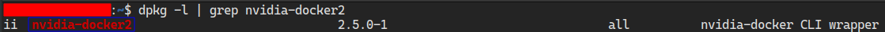
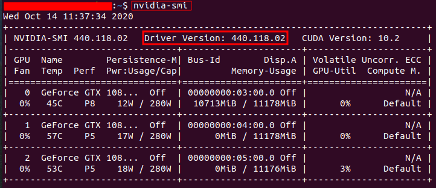
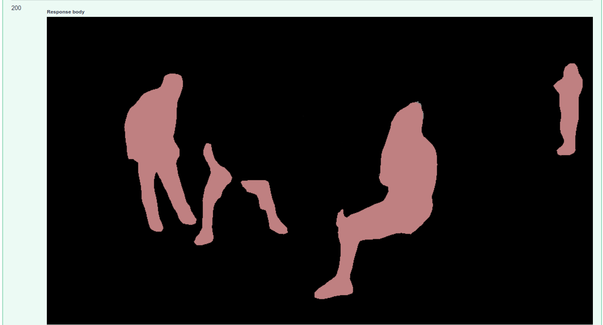

# BMW Semantic Segmentation GPU/CPU Inference API
This is a repository for a Semantic Segmentation inference API using the [Gluoncv CV toolkit](https://cv.gluon.ai/contents.html).

The training GUI (also based on the [Gluoncv CV toolkit](https://cv.gluon.ai/contents.html) ) for the Semantic Segmentation workflow will be published soon.

A sample inference model is provided with this repository for testing purposes.

This repository can be deployed using  **docker**.

**Note: To be able to use the sample inference model provided with this repository make sure to use** `git clone` **and avoid downloading the repository as ZIP because it will not download the actual model stored on** `git lfs` **but just the pointer instead**


## Prerequisites

- Ubuntu 18.04 or 20.04 LTS
- Windows 10 pro with **hyper-v** enabled and **docker** desktop 
- NVIDIA Drivers (410.x or higher) 
- Docker CE latest stable release
- NVIDIA Docker 2
- Git lfs (large file storage) : [installation](https://github.com/git-lfs/git-lfs/wiki/Installation)

*Note: the **windows** deployment supports only CPU version thus **nvidia driver** and **nvidia docker** are not required*

### Check for prerequisites

To check if you have docker-ce installed:

```
docker --version
```

To check if you have nvidia-docker2 installed:

```
dpkg -l | grep nvidia-docker2
```



**To check your nvidia drivers version, open your terminal and type the command `nvidia-smi`**



### Install prerequisites

Use the following command to install docker on Ubuntu:

```
chmod +x install_prerequisites.sh && source install_prerequisites.sh
```

Install NVIDIA Drivers (410.x or higher) and NVIDIA Docker for GPU by following the [official docs](https://github.com/nvidia/nvidia-docker/wiki/Installation-(version-2.0))


## Build The Docker Image

To build the docker environment, run the following command in the project's directory:  

- For GPU Build:  

```sh
docker build -t gluoncv_segmentation_inference_api_gpu -f ./GPU/dockerfile .
```

- For CPU Build:

```
docker build -t gluoncv_segmentation_inference_api_cpu -f ./CPU/dockerfile .
```


### Behind a proxy

- For GPU Build:  

```sh
docker build --build-arg http_proxy='' --build-arg https_proxy='' -t gluoncv_segmentation_inference_api_gpu -f ./GPU/dockerfile .
```

- For CPU Build:

```sh
docker build --build-arg http_proxy='' --build-arg https_proxy='' -t gluoncv_segmentation_inference_api_cpu -f ./CPU/dockerfile .
```


## Run the docker container

To run the inference  API go the to the API's directory and run the following:


#### Using Linux based docker:

- For GPU:

```sh
docker run --gpus '"device=<- gpu numbers seperated by commas ex:"0,1,2" ->"' -itv $(pwd)/models:/models -p <port-of-your-choice>:4343 gluoncv_segmentation_inference_api_gpu
```
- For CPU:

```sh
docker run -itv $(pwd)/models:/models -p <port-of-your-choice>:4343 gluoncv_segmentation_inference_api_cpu
```

- For Windows

```sh
docker run -itv ${PWD}/models:/models -p <port-of-your-choice>:4343 gluoncv_segmentation_inference_api_cpu
```


## API Endpoints

To see all available endpoints, open your favorite browser and navigate to:

```
http://<machine_URL>:<Docker_host_port>/docs
```
The 'predict_batch' endpoint is not shown on swagger. The list of files input is not yet supported.

### Endpoints summary

#### /load (GET)

Loads all available models and returns every model with it's hashed value. Loaded models are stored and aren't loaded again

#### /detect (POST)

Performs inference on specified model, image, and returns json file

#### /get_labels (POST)

Returns all of the specified model labels with their hashed values

#### /models (GET)

Lists all available models

#### /models/{model_name}/load (GET)

Loads the specified model. Loaded models are stored and aren't loaded again

#### /models/{model_name}/predict (POST)

Performs inference on specified model, image, and returns json file (exactly like detect)

#### /models/{model_name}/predict_image (POST)

Performs inference on specified model, image, and returns the image with transparent segments on it.

#### /models/{model_name}/inference (POST)

Performs inference on specified model,image, and returns the segments only (image) 



#### /models/{model_name}/labels (GET)

Returns all of the specified model labels

#### /models/{model_name}/config (GET)

Returns the specified model's configuration

## Model structure

The folder "models" contains sub-folders of all the models to be loaded.

You can copy your model sub-folder generated after training ( training GUI will be published soon ) , put it inside the "models" folder in  your inference repos and you're all set to infer. 	

The model sub-folder should contain the following : 

- model_best.params

- palette.txt 
  **If you don't have your own palette, you can generate a random one using the command below in your project's repository and copy `palette.txt` to your model directory:**

```sh
python3 generate_random_palette.py

```
- configuration.json


The configuration.json file should look like the following : 

```json
{
    "inference_engine_name" : "gluonsegmentation",
    "backbone": "resnet101",
    "batch-size": 4,
    "checkname": "bmwtest",
    "classes": 3,
    "classesname": [
        "background",
        "pad",
        "circle"
    ],
    "network": "fcn",
    "type":"semantic",
    "epochs": 10,
    "lr": 0.001,
    "momentum": 0.9,
    "num_workers": 4,
    "weight-decay": 0.0001
}
```

## Acknowledgements


- Roy Anwar,Beirut, Lebanon
- Hadi Koubeissy, [inmind.ai](https://inmind.ai/), Beirut, Lebanon
